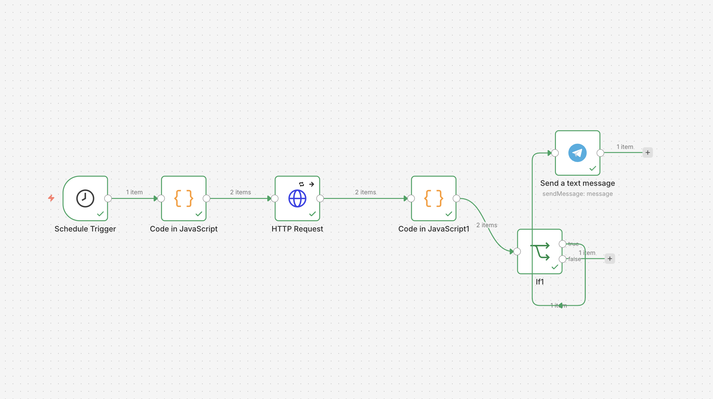

# n8n Website Uptime Monitor to Telegram

A professional n8n workflow that monitors your website's availability and sends instant alerts via Telegram if any downtime is detected.

## 🚀 Features

- **Automated Monitoring**: Checks website status at regular intervals (Cron).
- **Instant Alerts**: Sends a detailed message to a Telegram bot when the site is down.
- **Error Handling**: Captures HTTP error codes for easier debugging.
- **Lightweight**: Minimal node setup for high efficiency.

## 🛠️ Workflow Logic

1. **Schedule Trigger**: Runs every X minutes (configurable).
2. **HTTP Request**: Pings the target URL.
3. **IF Node**: Checks if the response code is 200 (OK).
4. **Telegram Node**: Sends a notification if the IF condition fails (site is down).

## 📸 Screenshots

*Figure 1: Complete workflow canvas overview.*

## 📖 How to Import

1. Download the `website-uptime-monitor.json` file from this repo.
2. Open your n8n instance.
3. Import the JSON file or copy-paste its content directly onto the canvas.
4. **Configuration**:
   - Update the **HTTP Request** node with your website URL.
   - Configure your **Telegram Bot Token** and **Chat ID** in the Telegram node.

## ⚠️ Requirements

- **n8n** instance (Docker, Cloud, or Desktop).
- A **Telegram Bot** (created via @BotFather).

---
Designed for reliability and peace of mind.